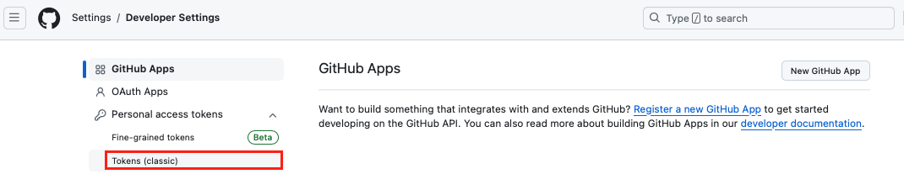

## Bring_Labels: Label 가져오기

> "Repository Template를 설정해도 Template은 Label 정보까진 들고오지 않는다."

|WHEN?|
|:---|
|기존 라이브러리의 Label Setting을 가져오고 싶을 때|

### HOW TO

|사전 조건: Access Token을 발급받아야한다.|
|:---:|
|`Settings` -> `Developer Settings` -> 토큰 발급|
|권한은 `Repo`만|
||
 
1. Terminal에서 `github-label-sync` 설치하기
```shell
npm i github-label-sync
```
2. Label들의 정보를 가져오고 싶은 Repository 선택하기

3. Label을 들고오기 위한 Javascript `label.js` 작성
```javascript
const githubLabelSync = require('github-label-sync');

githubLabelSync({
    accessToken: [Access Token 기입],
    repo: '계정이름/Label을추출하는저장소이름'
    labels: [],
    dryRun: true,
}).then(diff => {
    console.log(diff);
});
```

4. Terminal에서 `label.js` 실행
```shell
node label.js >> temp.txt
```
`label.js`의 log를 `temp.txt`에 담겠다.

5. 추출한 데이터 중 actual 하위에 있는 값들을 json으로 파싱 (`label.json`)

__예시__
```txt
[
  {
    name: 'SOME TAG',
    type: 'added',
    actual: {
      name: 'SOME TAG',
      color: 'FFFFFF',
      description: '태그 설명'
    },
    expected: null
  },
  {
    name: 'SOME TAG 2',
    type: 'added',
    actual: {
      name: 'SOME TAG 2',
      color: '000000',
      description: '태그 설명 2'
    },
    expected: null
  }
]
```
여기서 actual 하위의 데이터를 json으로 만든다
```json
[
    {
        "name" : "SOME TAG",
        "color" : "FFFFFF",
        "description": "태그 설명"
    },
    {
        "name" : "SOME TAG 2",
        "color" : "000000",
        "description": "태그 설명 2"
    },
]
```


6. Terminal에서 Label Setting을 원하는 Repository에 덮어씌운다.
```shell
npx github-label-sync --access-token [Access Token] --labels label.json 계정이름/덮어씌울Repository
```

7. 추후에 Access Token을 사용할 예정이 없다면 Setting 페이지에서 Token 지우기